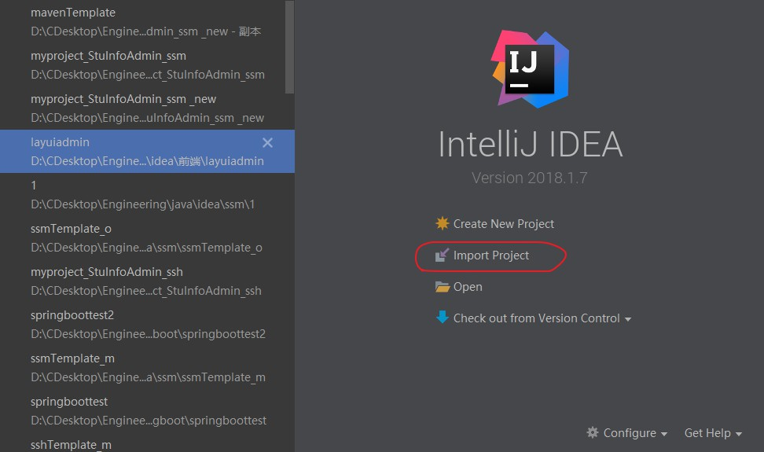
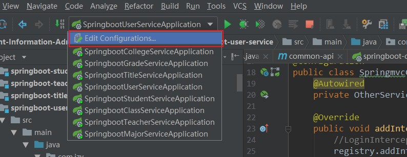
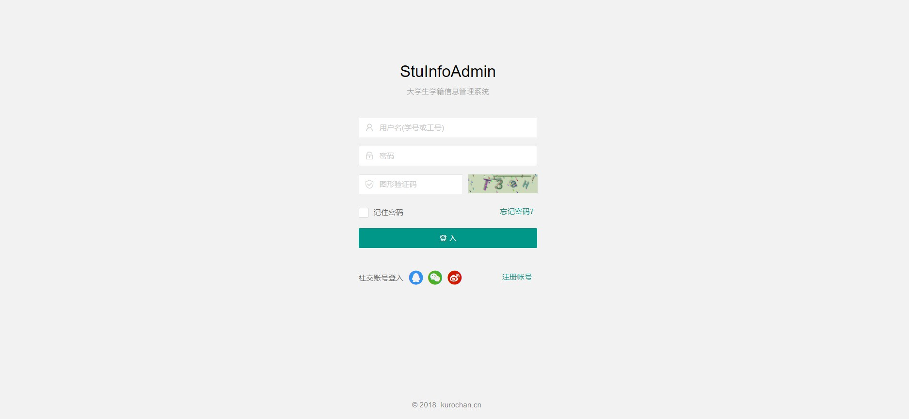
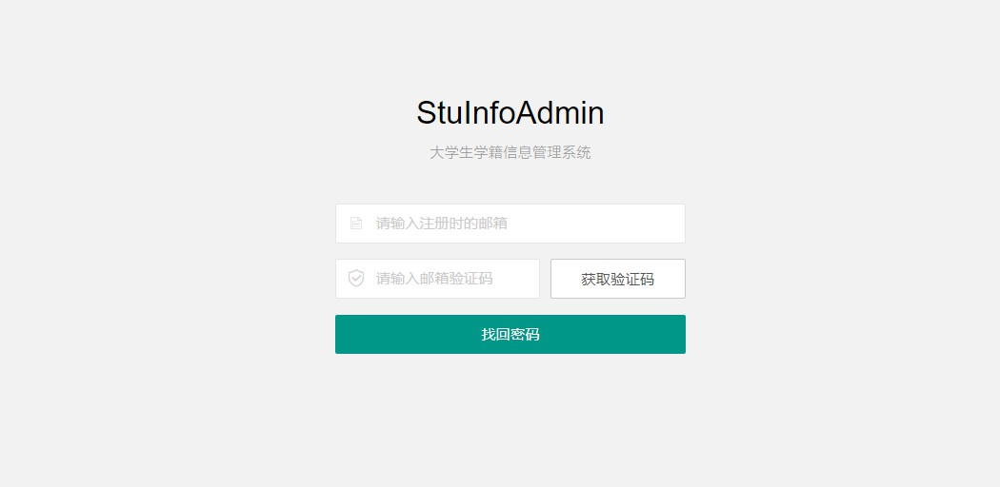
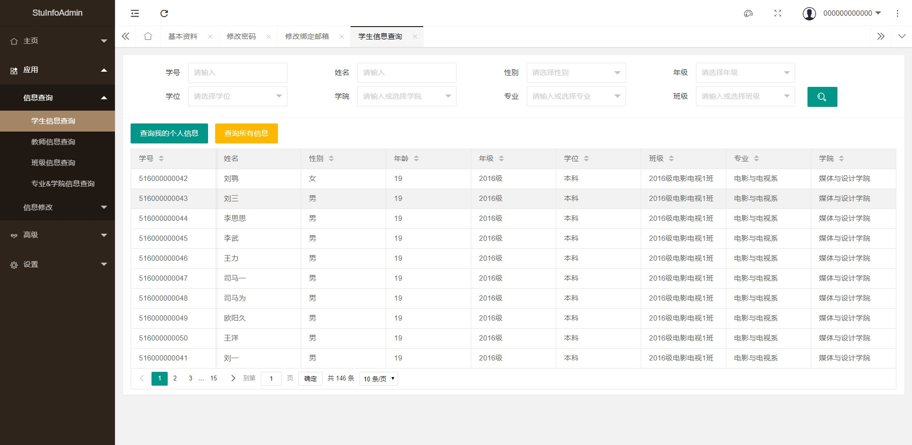
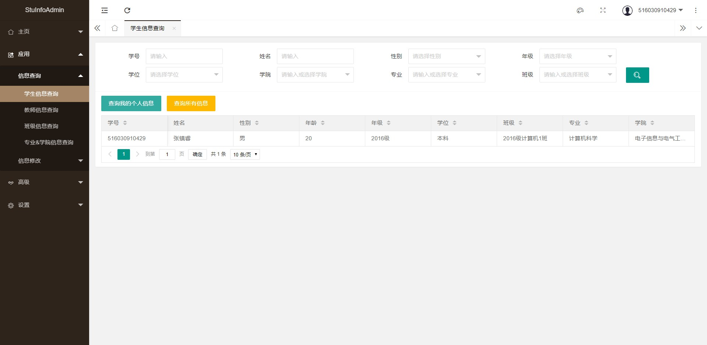
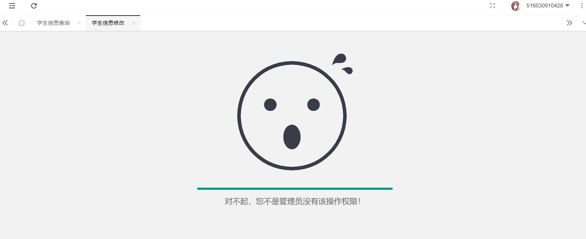
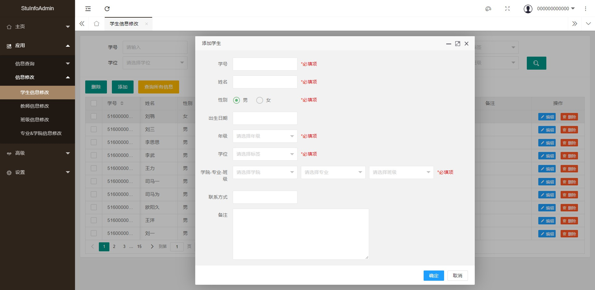

## Brief Introduction
这个项目是一个大学生信息管理系统,提供用户级别的登录注册资料管理,信息查询,信息修改（管理员权利），简单的数据可视化分析等功能，也有基本的安全性保障。

该项目为master项目的分支项目，系统的架构是基于`dubbo`+`zookeeper`搭建的微服务，每个服务后端是由`SpringBoot`+`Mybatis`实现，功能上与主支SSM项目相同。（这个dubbo微服务项目的环境配置和项目结构相对比较复杂，**java初学者慎入！！！**）

* SpringMVC+Spring+Mybatis主支：[https://github.com/KuroChan1998/Student-Information-Administration-System/tree/master](https://github.com/KuroChan1998/Student-Information-Administration-System/tree/master)
* SpringBoot+Mybatis分支：[https://github.com/KuroChan1998/Student-Information-Administration-System/tree/Sb_M](https://github.com/KuroChan1998/Student-Information-Administration-System/tree/Sb_M)

## Release Notes

### v1.0.0 - 2019.10.16 (Current Version)

*版本1.0.0（同步SSM主支v1.3.0）：*

* 项目根据不同的功能模块分为*学生、教师、班级、专业、学院、年级、职称、用户*8个服务模块
* *学生、教师、班级、专业、学院、年级、职称*都是作为对外暴露的7个服务模块（分别暴露服务接口StudentService, TeacherService, ClassService, MajorService, CollegeService, GradeService, TitleService），基于dubbo暴露于不同的端口下，他们既是提供者也是消费者；*用户*服务模块，其中OtherService作为提供验证码发送等其他业务也隶属于用户服务的子服务，因此归于用户服务范畴，对外只暴露UserService接口。用户服务同时也是一个web项目，启动该服务的同时会启动springboot内置tomcat。
* common-api模块作为所有服务模块的公共api，提供entity对象、dto对象、工具类、自定义异常类等等。
* 该项目为多模块项目，根（父）模块中没有代码；common-api是其子项目，其他服务子模块StudentService等都引用common-api，因此也是根（父）模块的子模块。

[更多历史版本](#update_history)


## Technologies Used
### 前端
* 前端框架 : `layui`
* 数据可视化框架 : `echarts`

### 后端
* MVC&IOC框架 : `SpringBoot`
* ORM框架 : `Mybatis`
* RPC框架：`Dubbo`
* 注册中心：`Zookepper`
* 缓存技术：`Redis`
* 数据库：`Mysql`
* 日志框架 : `Log4j`

## Project Structure

```
├─common-api   //dubbo项目的公共api模块
│  ├─src
│  │  ├─main
│  │  │  ├─java        // java代码目录
│  │  │  │  └─com
│  │  │  │      └─jzy
│  │  │  │          ├─dto            // 传输对象
│  │  │  │          ├─entity         // 实体类
│  │  │  │          ├─exception      // 自定义异常类
│  │  │  │          ├─service        // 服务层接口，其实现在各自的服务模块中
│  │  │  │          └─util           // 工具方法
│  │  │  └─resources                 // 资源文件目录
│  │  └─test                         // 测试代码目录
├─database                          // 数据库相关文件
│  ├─design				            // 数据库设计
│  │  └─1
│  └─sql                            // 数据库初始化脚本文件
├─git_screenshot                    // 存放README.md 中的图片
├─springboot-class-service          // 班级服务模块
│  ├─src                            
│  │  ├─main                        
│  │  │  ├─java 
│  │  │  │  └─com
│  │  │  │      └─jzy               // java代码目录
│  │  │  │          ├─config        // springboot配置类
│  │  │  │          ├─dao           // 持久层
│  │  │  │          ├─log           // 日志管理
│  │  │  │          └─service       
│  │  │  │              └─impl     // 对应服务接口的实现
│  │  │  └─resources               // 资源文件目录        
│  │  │      └─mapper              // mybatis对dao接口的xml实现
│  │  └─test                       // 测试代码目录
├─springboot-college-service       // 学院服务模块，结构与springboot-class-service相同
├─springboot-grade-service         // 年级服务模块，结构与springboot-class-service相同
├─springboot-major-service         // 专业服务模块，结构与springboot-class-service相同
├─springboot-student-service       // 学生服务模块，结构与springboot-class-service相同
├─springboot-teacher-service       // 教师服务模块，结构与springboot-class-service相同
├─springboot-title-service         // 职称服务模块，结构与springboot-class-service相同
├─springboot-user-service          // 用户服务模块，同时也是web项目
│  ├─src
│  │  ├─main
│  │  │  ├─java
│  │  │  │  └─com
│  │  │  │      └─jzy
│  │  │  │          ├─config        // springboot配置类
│  │  │  │          ├─controller    // 控制层
│  │  │  │          ├─dao           // 持久层
│  │  │  │          ├─interceptor   // 拦截器
│  │  │  │          ├─log           // 日志管理
│  │  │  │          └─service       
│  │  │  │              └─impl      // 对应服务接口的实现
│  │  │  ├─resources
│  │  │  │  ├─mapper                // mybatis对dao接口的xml实现
│  │  │  │  ├─static                // springboot默认静态资源目录
│  │  │  │  └─templates             // springboot默认页面模板目录
│  │  │  └─webapp                   // tomcat前端文件目录
│  │  │      ├─static               // 静态资源
│  │  │      │  ├─custom            // 自定义静态资源
│  │  │      │  └─plugins           // 插件类静态资源
│  │  │      └─WEB-INF
│  │  │          └─page             // jsp页面目录 
│  │  └─test
├─src                               // 根项目源代码目录，这里为空
│  ├─main
│  │  ├─java
│  │  └─resources
│  └─test
│      └─java
├─README.md                         // help
├─ISSUES.md                         // 问题大全
└─pom.xml                           // 根项目maven依赖
```

### 说明

* 项目根据不同的功能模块分为*学生、教师、班级、专业、学院、年级、职称、用户*8个服务模块
* *学生、教师、班级、专业、学院、年级、职称*都是作为对外暴露的7个服务模块（分别暴露服务接口StudentService, TeacherService, ClassService, MajorService, CollegeService, GradeService, TitleService），基于dubbo暴露于不同的端口下，他们既是提供者也是消费者；*用户*服务模块，其中OtherService作为提供验证码发送等其他业务也隶属于用户服务的子服务，因此归于用户服务范畴，对外只暴露UserService接口。用户服务同时也是一个web项目，启动该服务的同时会启动springboot内置tomcat。
* common-api模块作为所有服务模块的公共api，提供entity对象、dto对象、工具类、自定义异常类等等。
* 该项目为多模块项目，根（父）模块中没有代码；common-api是其子项目，其他服务子模块StudentService等都引用common-api，因此也是根（父）模块的子模块。

## Quick Start

### 1 : 项目开发环境
- IDE : `IntelliJ IDEA 2018.1.7`
- 项目构建工具 : `Maven 3.x`
- 注册中心：`Zookeeper-3.4.13`
- 数据库 : `Mysql 8.0.13`
- Redis：`Redis server 3.2.100`
- JDK版本 : `jdk 1.8`
- Tomcat版本 : `Tomcat 8.x`


### 2 : 项目的初始构建
1. *在你的Mysql中，运行我提供的database/sql/init.sql 文件（注意mysql版本与sql脚本中部分代码的兼容性）, 成功会创建名为mydatabase2的数据库，以及user、student、teacher、class、major、college、title、grade八个表*

*数据库物理模型如下 :*


2. *使用 IntelliJ IDEA 导入项目，选择Maven项目选项，一路点击next，即可将项目所需依赖导入（若依赖下载速度较慢，请参考百度更改国内镜像）。若有无法引入的依赖，可能是因为maven版本不同或是该依赖已过时不存在于现有maven仓库中，请前往maven官网映入最新的该类型依赖*




3. *修改各模块配置：*

   * 进入子模块springboot-class-service的src/main/resources修改application.properties：

     * 修改dubbo和zookeeper配置：

       每个服务模块暴露在不同的dubbo服务端口，若无冲突不建议修改此项。

       ```properties
       #dubbo服务端口，若无冲突不建议修改
       dubbo.protocol.port=20883
       dubbo.protocol.name=dubbo
       #dubbo服务名称，不建议修改
       dubbo.application.name=springboot-class-service
       ```

       对dubbo的管理工具dubbo-admin和监控中心dubbo-monitor-simple的使用： [https://github.com/apache/dubbo-admin/tree/master](https://github.com/apache/dubbo-admin/tree/master)。相关配置和启动相对简单，请自行百度。

       若您不开启监控中心dubbo-monitor-simple，请注释`dubbo.monitor.protocol=registry`。

       开启管理工具dubbo-admin和监控中心dubbo-monitor-simple前必须**确保zookeeper注册中心已经开启**！

       ```properties
       #注册中心地址
       dubbo.registry.address=zookeeper://127.0.0.1:2181
       dubbo.consumer.check=false
       #若不开启dubbo监控中心，请将下行注释
       dubbo.monitor.protocol=registry
       ```

     * 修改mysql连接信息

       ```properties
       spring.datasource.driver-class-name = com.mysql.jdbc.Driver
       #你的mysql连接url，localhost(本机)，端口：3306（默认），数据库：mydatabase2（第一步完成创建）
       spring.datasource.url = jdbc:mysql://localhost:3306/mydatabase2?useUnicode=true&characterEncoding=utf8&serverTimezone=GMT%2B8&useSSL=false
       #你的mysql用户名
       spring.datasource.username=root
       #你的mysql密码
       spring.datasource.password=123
       ```

     * 修改redis连接信息

       ```properties
       #redis
       #你的redis主机地址
       spring.redis.host = localhost
       #你的redis端口
       spring.redis.port = 6379
       #你的redis密码
       spring.redis.password = 123
       ```

   * 以与springboot-class-service相同的方式，依次修改*springboot-college-service、springboot-grade-service、springboot-major-service、springboot-student-service、springboot-teacher-service、springboot-title-service*的src/main/resources下的application.properties

   * 进入子模块springboot-user-service（web模块）的src/main/resources修改application.properties：

     * 先完成springboot-class-service中提及的配置修改

     * 此外，如果有必要可以修改当前项目部署端口和部署路径（可选）

       ```properties
       #端口
       server.port= 80
       #项目部署路径
       server.context-path= /
       ```

     * *进入src/main/resources查看log4j.properties，如果有必要可以修改日志输出路径，目前在D盘下，你可选择不修改跳过此步*

4. *依次启动各服务模块：*

   * 确保zookeeper注册中心已经开启

   * 进入springboot-class-service，运行com.jzy.SpringbootClassServiceApplication

     如果有抛出一些异常，是因为其仅作为暴露的服务不需要springboot内置的tomcat，所以在common-api中排除了tomcat依赖，而项目启动过程中对HttpSession进行检查时会报没有找到。这并不影响项目的启动。

     ```
     java.lang.reflect.InvocationTargetException: null
     	...
     Caused by: java.lang.NoClassDefFoundError: javax/servlet/http/HttpSession
     	...
     Caused by: java.lang.ClassNotFoundException: javax.servlet.http.HttpSession
     	...
     ```

     如果出现如下的信息，就表示该模块启动成功。

     

   * 进入springboot-college-service，运行com.jzy.SpringbootCollegeServiceApplication；以此类推，分别运行启动*springboot-grade-service、springboot-major-service、springboot-student-service、springboot-teacher-service、springboot-title-service*

   * idea中修改子模块springboot-user-service（web模块）的运行配置，**这一步至关重要！！！**不然项目运行后无法访问到jsp页面。

     点击edit configuration

     

     修改working directory为$MODULE_DIR$

     

   * 进入子模块springboot-user-service（web模块），运行com.jzy.SpringbootUserServiceApplication。可以在dubbo-admin中查看服务状态是否正常。

     

   * 在浏览器中输入localhost:80/login，进入用户登录页面


     

5. *登录账户/密码(你也可以自行注册一个账户登录哟)*

  - 管理员账户：000000000000/admin1
  - 学生账户：516030910429/123456
  - 教师账户：1000000001/123456

### 3：项目的打包

* 在配置好maven的环境变量的前提下，在项目根目录下（即父模块）cmd打开命令，输入 `mvn clean package -Dmaven.test.skip=true`，即可在所有子模块的/target/目录下得到相应jar包和war包。其中springboot-user-service被打包成war包，其他都是jar包。

* 依次cd进入*springboot-class-service、springboot-college-service、springboot-grade-service、springboot-major-service、springboot-student-service、springboot-teacher-service、springboot-title-service*的/target/目录下，执行`java -jar xxxx.jar`命令，启动各服务。

  进入*springboot-user-service*的/target/目录下，执行`java -jar springboot-user-service.war`命令，启动web服务，在浏览器中输入localhost:80/login，即可和上面一样进入用户登录页面。

## Detailed Functions
### 用户服务
* 登录：如上文图所示

* 注册

  

* 忘记密码后的重置密码（含发送邮箱验证码）

  

* 登录进入主页

  

* 修改基本资料

  

* 修改密码

  

* 修改绑定邮箱

  


### 信息查询
* 学生信息查询

  * 查询所有信息

    

  * 根据登录用户的用户名（应以学号注册）查询当前个人的学籍信息，若注册时未以真实学号注册，则无法查询到。

    

  * 模糊查询搜索

    

* 教师信息查询：类似学生信息查询，图略

* 班级信息查询：类似学生信息查询，图略

* 专业&学院信息查询：类似学生信息查询，图略


### 信息修改
* 学生信息修改

  * 此功能必须以管理员用户身份登录，否则会跳转至异常页面

    

  * 编辑信息

    

  * 添加

    

  * 单条、多条删除

    

* 教师信息修改：类似学生信息修改，图略

* 班级信息修改：类似学生信息修改，图略

* 专业&学院信息修改：类似学生信息修改，图略


### 拓展功能
* 学生男女比可视化


* 学生人数比可视化


* 师资力量可视化

  

## <span id='update_history'>Update History</span>


## Contact me

- qq: 929703621
- wechat: Jzy_bb_1998
- e-mail: 929703621@qq.com
- soul: despacito

欢迎提出意见与建议~